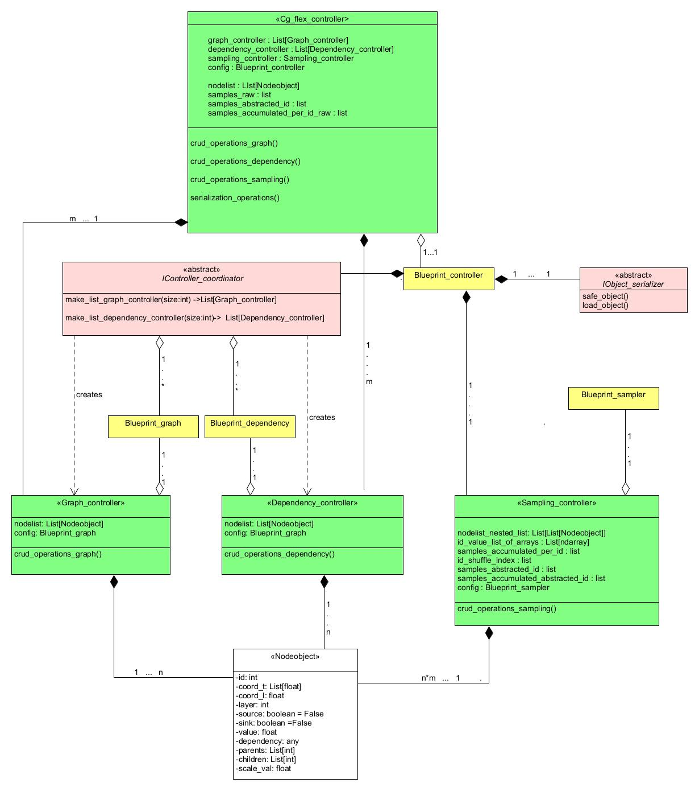
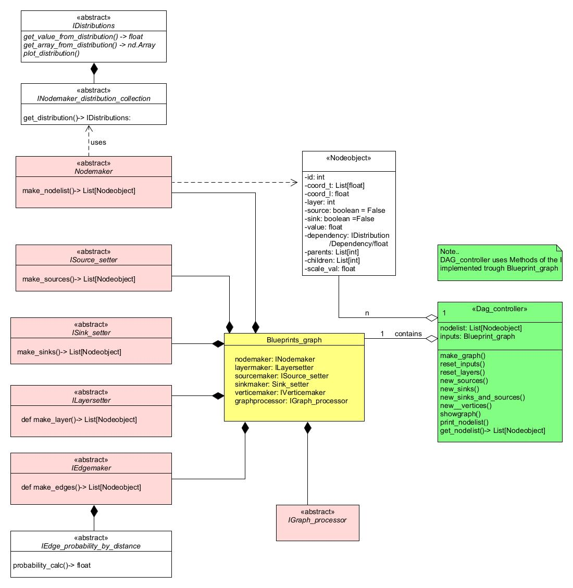
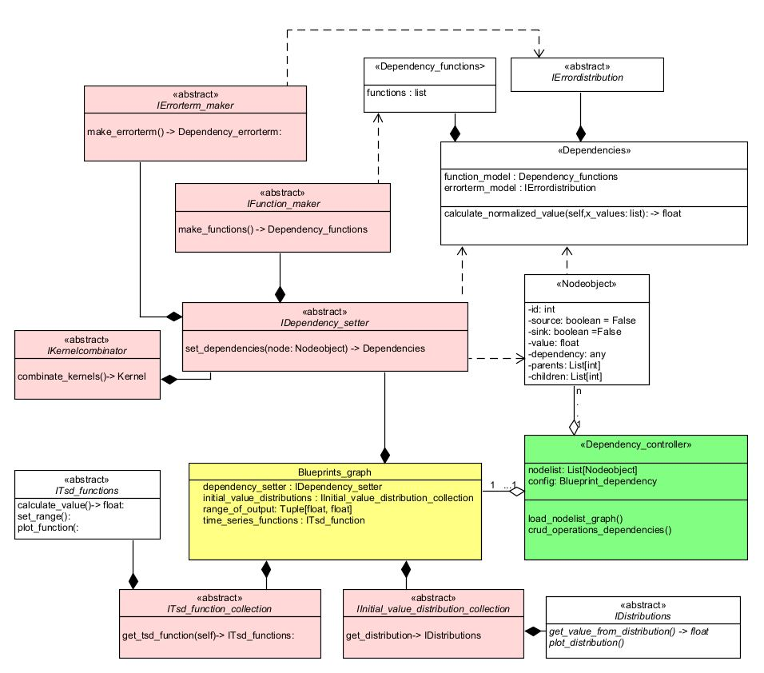

Class Structure and Sequence UMLs
=======================================

The framework comprises of a Main Controller and three Sub Controllers, coloured green in the UML diagrams.
The Main Controller serves as the central user interface, coordinating the Sub Controllers
Sub Controllers manage subclasses and offer fundamental methods. Each focused on a specific area: graph, dependency, and sampling control. 

Abstract base classes serve as interfaces are and are coloured pink.
In the UML diagrams Concrete implementations are not shown. 
Users can use existing or add their own implementation classes through these interfaces.

The configuration objects, represented in yellow in the diagrams, allow users to select which specific implementations of the interfaces are used and how they are parameterized.

.. image:: diagrams/UMLbasic.jpg
   :alt: Basic example UML class diargam
   :align: center
   :width: 400px

UML class diagrams
-------------------
**Highlevel: Main Controller** 

**Graph Controller** 

**Dependency Controller**

**Sampling Controller**

.. image:: diagrams/UML_sampler.jpg
   :alt: UML class diagram
   :align: center
   :width: 600px

UML sequence diagrams
---------------------

**Graph creation sequence**

Shows how classes inside the Graph Controller interact in the Graph generation process.

.. image:: diagrams/sequenz_graph_controller.jpg
   :alt: UML sequence diagram
   :align: center
   :width: 700px

**Dependency creation sequence**

Shows how classes inside the Dependency Controller interact in the Dependency generation process.

.. image:: diagrams/Dependencymaker_sequenz.jpg
   :alt: UML sequence diagram
   :align: center
   :width: 700px

UML Object structure diagrams
-----------------------------

Shows the basic structure of the most important Objects used in the Framework:
1: Nodelist
2: Samples

**Node list**

Graph components are represented by a list of NodeObject instances. If a Graph consists of many components, it is a nested list structure.

.. image:: diagrams/Nodelists.jpg
   :alt: UML sequence diagram
   :align: center
   :width: 300px

**Samples**

Samples are stored as Id_value_pairs for each node inside each graph component, for each sample. Nested list/array structure.

.. image:: diagrams/Id_value_pairs.jpg
   :alt: UML sequence diagram
   :align: center
   :width: 300px

**Samples acumulated**
